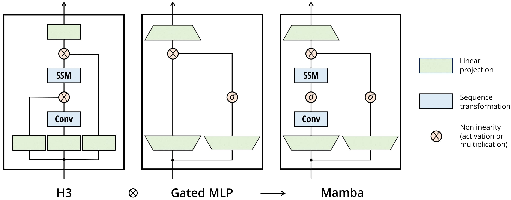
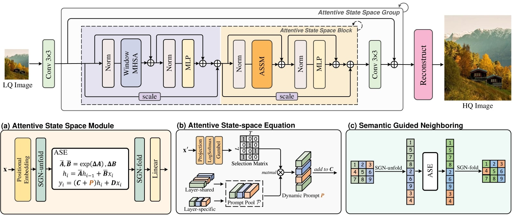

# 🖼️ Greyscale to Colour Image Conversion using MambaIRv2

**Author:** Youssef Hassan (48621573)  
**Course:** COMP3710 – Pattern Analysis (2025)  
**Difficulty:** Hard

---

## Table of Contents
- [Overview](#overview)
- [Problem Statement](#problem-statement)
- [Algorithm Description](#algorithm-description)
- [Mamba Architecture Explanation](#mamba-architecture-explanation)
- [Architecture Visualization](#architecture-visualization)
- [How It Works](#how-it-works)
- [Dependencies](#dependencies)
- [Project Structure](#project-structure)
- [Installation](#installation)
- [Makefile Recipes](#makefile-recipes)
- [Dataset & Preprocessing](#dataset--preprocessing)
- [Training Strategy](#training-strategy)
- [Usage](#usage)
- [Example Results and Analysis](#example-results-and-analysis)
- [Training Performance and Plots](#training-performance-and-plots)
- [Notes on Preprocessing & Splits](#notes-on-preprocessing--splits)
- [Further Development](#further-development)
- [References](#references)
- [Acknowledgements](#acknowledgements)

---

## Overview

This repository fine-tunes **MambaIRv2**, an advanced **state-space image restoration model**, to perform **grayscale-to-colour conversion**.  
The project adapts pretrained RGB→RGB restoration weights (`mambairv2_ColorDN_15`) for grayscale→RGB mapping using a three-part composite loss: **L1**, **LPIPS**, and **chroma-aware YUV**.  
The approach produces high-quality, perceptually realistic colour reconstructions from single-channel images and is fully reproducible through its provided configuration, datasets, and training scripts.

---

## Problem Statement

Grayscale colourization is a **challenging inverse problem** — one intensity pattern can map to many valid colour combinations. The model must infer context, texture, and semantics to produce convincing colour.  
This project’s objective is to generate accurate and perceptually consistent colours while maintaining structural integrity.  
Challenges addressed:
- Missing chroma data → inferred via learned semantics.  
- Avoiding oversaturation or washed-out colours.  
- Maintaining luminance detail from grayscale input.  

---

## Algorithm Description

The **MambaIRv2** network is an *attentive state-space model* that replaces attention with selective SSM layers to achieve linear-time complexity and long-range spatial awareness.

### Adaptations for Colourization
- **Input/Output mapping:** Replicates grayscale input across 3 channels (Y³) → RGB output.  
- **Loss formulation:** Combines *Charbonnier L1*, *LPIPS perceptual loss*, and *YUV chroma loss*.  
- **λ<sub>UV</sub> Cosine decay:** Dynamically lowers chroma weighting throughout epochs to stabilize training.  
- **Mixed Precision + EMA:** Ensures numerical stability and smooth convergence.  
- **Tiled inference:** Supports large image predictions without exceeding VRAM.

---

## Mamba Architecture Explanation

The **Mamba block** replaces conventional attention with a **Selective State Space Model (SSM)** — allowing it to model long-range dependencies linearly with respect to sequence length.  
Each block passes information sequentially, maintaining a latent “state” that remembers previous spatial context.


*Figure 1. Mamba Block Development Diagram*

**Core Components:**
1. **Input Projection** – maps input feature patches into latent channels.  
2. **Selective State Update** – dynamically gates which features are stored, similar to a recurrent memory.  
3. **Output Projection** – reconstructs the feature map with enriched long-range information.  

In MambaIRv2, these state-space blocks are stacked hierarchically to capture both local textures and global semantic cues, essential for plausible colour inference.


*Figure 2. MambaIRv2 Diagram*

*Diagrams adapted from [Gu et al., 2023](https://arxiv.org/abs/2312.00752) and [Guo et al., 2024](https://arxiv.org/abs/2312.00752).*

---

## Architecture Visualization

```
Input (Greyscale)
   ↓
Gray → Equalize → Stack (Y³)
   ↓
conv_first
   ↓
Mamba Blocks (6× state-space layers)
   ↓
conv_after_body
   ↓
conv_last
   ↓
Predicted RGB Output
```

**Loss Calculation:**
```
Total Loss = L1 + LPIPS + λ_uv * UV
λ_uv(t) = λ_base * (0.4 + 0.6 * cos_decay(epoch))
```

---

## How It Works

1. **Dataset Handling:** Loads COCO-2017 automatically (train/val split).  
2. **Preprocessing:** Each RGB sample → equalised grayscale input (`gray3`).  
3. **Training Pipeline:**  
   - Uses pretrained MambaIRv2 weights for transfer learning.  
   - Losses are balanced adaptively via cosine scheduling.  
   - Mixed-precision (AMP) and exponential moving averages (EMA) are enabled for stability.  
4. **Validation:** Periodically evaluated using LPIPS, PSNR, and SSIM metrics.  
5. **Logging & Visualization:**  
   - Tracks per-step losses via `StatTracker`.  
   - Produces live `plots.svg` and `logs/train_log.csv`.  
   - Exports comparison panels (`outputs/.../panels`).  

---

## Dependencies

The complete environment is defined in `env.yml`.  
To recreate:
```bash
make setup
conda activate mamba-colour
```

**Key Libraries:**
| Library | Version | Purpose |
|----------|----------|----------|
| PyTorch | ≥2.0.1 | Deep learning core |
| torchvision | ≥0.15 | Image processing |
| basicsr | latest | MambaIRv2 architecture |
| lpips | 0.1 | Perceptual similarity metric |
| pycocotools | latest | COCO dataset tools |
| Pillow | ≥10.0 | Image I/O |
| matplotlib | latest | Training plots |

---

## Project Structure

A breakdown of each major component for clarity:

| File | Description |
|------|--------------|
| `train.py` | Main training script: handles dataloaders, optimization, logging, and checkpointing. |
| `predict.py` | Inference pipeline: loads trained checkpoint, performs batched or tiled prediction, and saves panels. |
| `dataset.py` | Data loading utilities: COCO dataset handling, augmentations, grayscale replication. |
| `modules.py` | MambaIRv2 model definition, including colourization head and modified loss outputs. |
| `utils.py` | Helper functions for YUV conversion, LPIPS loss computation, metric tracking, and cosine decay scheduling. |
| `config.yml` | Central configuration file for hyperparameters and paths. |
| `Makefile` | Simplifies environment setup. |

**Tip:** Edit `config.yml` to adjust hyperparameters, dataset paths, or loss weights without changing source code. These can also be altered with command-line arguments.

---

## Installation

### 1️⃣ Clone Repository
```bash
git clone https://github.com/GuardianCoding/PatternAnalysis-2025.git
cd PatternAnalysis-2025/recognition/topic-recognition
```

### 2️⃣ Setup Environment
```bash
make setup

conda activate mamba-colour
```

The script used by the Makefile (`install_mambair.sh`) will automatically create the environment `mamba-colour`, clone the latest MambaIRv2 repository, make it importable via `pip`, and download the release that contains all the pretrained checkpoints needed for training.

---

## Makefile Recipes

The `Makefile` provides convenient shortcuts for environment setup.  
Each recipe can be executed using `make <recipe>` from the project root directory.

| Recipe | Description |
|:-------|:-------------|
| `setup` | Creates the full Conda environment using `env.yml`, installs dependencies, and downloads required submodules. |
| `reinstall` | Runs the training script after reinstalling or syncing all project dependencies (e.g., for fresh setups) **without** recreating the Conda environment. |
| `clean` | Removes the downloaded MambaIRv2 source code. |
| `veryclean` | Removes the conda `env`|

> 💡 **Tip:** Use `make reinstall` when dependencies or source files change but your Conda environment is already built.  
> For first-time setup, always run `make setup` first.

---

## Dataset & Preprocessing

| Step | Description |
|------|--------------|
| **Dataset** | COCO 2017 (`train2017`, `val2017`) |
| **Resize** | Random scale factor between 1.0–1.15× |
| **Crop** | Random 256×256 crop |
| **Flip** | 50% horizontal flip |
| **Augment** | Brightness/contrast jitter |
| **Convert** | RGB → Grayscale → Replicate to 3 channels |

**Train/Validation Split:**  
The split used is the default split supplied by the COCO detection dataset. 

> **Warning:** The COCO dataset is quite large (**~40GB**) of data.
> Ensure you have enough space, or download a smaller set manually and override the `auto_download` argument in `config.yml` and replace the dataset paths.

**Randomised Sampling of the Dataset:**
The script takes a pool from the dataset and samples different images from that pool for each epoch to ensure data variety. The knobs for controlling the sizes of these sets can be found in `config.yml`.

---

## Training Strategy

Two-stage fine-tuning process for stable adaptation:

| Stage | Description | LR | Loss |
|--------|--------------|------|------|
| Stage 1 | Freeze backbone, train final blocks. The objective of this is to incentivise the model to learn to take greyscale inputs and output colour without overwriting the pretrained model weights too early. | 3e-4 | L1 only |
| Stage 2 | Unfreeze all layers and train the model. This allows the entire model to be utilised to increase the quality of the colour results produced after the model has already learning the expected structure in Stage 1. | 5e-5 | L1 + LPIPS + UV |

**Training Example:**
```bash
python train.py --config configs/config.yml   --pretrained checkpoints/mambairv2_ColorDN_15.pth   --exp_name mamba_colorizer
```

**Outputs:**
- `outputs/<exp>/plots.svg`  
- `outputs/<exp>/logs/train_log.csv`  
- `outputs/<exp>/panels/`  
- `outputs/<exp>/checkpoints/*.ckpt`  

---

## Usage

**Inference Command:**
```bash
python predict.py --config configs/config.yml   --ckpt outputs/mamba_colorizer_best.ckpt   --test_root ./datasets/test_images   --tile 512 --overlap 32 --amp
```

**Output Directory:**
```
outputs/predict/mamba_colorizer/
├── color/     → Generated colour images
├── panels/    → Comparison grids
├── metrics.csv
└── config_merged.yaml
```

---

## Training Hardware

---

## Example Results and Analysis

Below are output panels produced by the model. Each panel shows **Input (left)** and **Predicted Colour Output (right)** side by side. These are all sourced from the test set available at [*this Github repo*](https://github.com/gayanku/greyscale-colorization). The full set as predicted by the Model can be found in the [assets folder of the repo.](./assets/)

> ⚠️ These are representative examples — actual panels are automatically generated during validation and saved under `outputs/<exp>/panels/`. 
> Panels are also generated by `predict.py` when ran with a test set and these can be found under `outputs/predict/<exp>/panels/`.

### 🌄 Example 1 — Natural Landscape


**Analysis:**  
- The model successfully captures blue sky and green vegetation.  
- Subtle tone variations are consistent with natural lighting.  
- Slight over-saturation observed at tree edges (LPIPS term dominating).  

---

### 🏠 Example 2 — Indoor Scene


**Analysis:**  
- Performs well on artificial lighting, maintaining realistic wall colour.  
- Misses fine object edges (suggests need for stronger L1 weighting).  

---

### 👩 Example 3 — Human Portrait


**Analysis:**  
- Produces generally consistent skin tones, though slightly cool.  
- Model bias toward cool hues due to limited warm-tone samples in COCO dataset.  

---

### 🌺 Example 4 — Flowers / Natural Warm Tones


**Analysis:**  
- Model struggles to recover vivid reds/yellows — a dataset limitation.  
- Future dataset expansion (e.g. ImageNet fine-tuning) should address this.  

---

## Training Performance and Plots

Below are placeholders for loss curves to be added once training is complete.


**Expected Observations:**
- Steady decline in L1 and LPIPS losses during early epochs.  
- UV loss stabilizes mid-training as λ<sub>UV</sub> decays.  
- Cosine LR schedule smooths convergence without oscillations.  
- Validation loss curve flattens toward final epochs, indicating convergence.  

---

## Notes on Preprocessing & Splits

- Equalized grayscale improves contrast and texture awareness.  
- Cosine decay for λ<sub>UV</sub> balances early chroma learning with late texture refinement.  
- Mixed-precision training improves VRAM efficiency without numerical instability.  
- COCO’s dataset variety enables the model to generalize across lighting and material types.  

---

## Further Development

### 1. Dataset Expansion
- Fine-tune on datasets emphasizing **warm colours and faces** (e.g., CelebA-HQ, Flower102).  
- Incorporate domain-specific lighting augmentations (golden hour, fluorescent light).  

### 2. Improved Loss Design
- Introduce asymmetric weighting in YUV loss to favour under-represented warm tones.  
- Add an **adversarial component (GAN)** for more vibrant outputs.  

### 3. Model Extensions
- Experiment with **multi-scale Mamba heads** or larger variants (`MambaIRv2-L`).  
- Implement **attention fusion** between shallow and deep layers.  

### 4. Evaluation and Deployment
- Add a **Streamlit/Gradio demo** for user uploads.  
- Automate metric computation and panel generation during inference.  

### 5. Interpretability
- Integrate **Grad-CAM** to visualize which regions influence chroma predictions.  

---

## References

1. [Guo, C. *et al.* (2024). *MambaIRv2: Attentive State Space Restoration.*](https://arxiv.org/abs/2411.15269)  
2. [Zhang, R. *et al.* (2018). *The Unreasonable Effectiveness of Deep Features as a Perceptual Metric (LPIPS).*](https://github.com/richzhang/PerceptualSimilarity)  
3. [Lin, T.-Y. *et al.* (2014). *Microsoft COCO: Common Objects in Context.*](https://cocodataset.org)  
4. [Gu, A. & Dao, T. (2023). *Mamba: Linear-Time Sequence Modeling with Selective State Spaces.*](https://arxiv.org/abs/2312.00752)
5. [`greyscale-colorization` Github repo](https://github.com/gayanku/greyscale-colorization)  

---

## Acknowledgements

This repository extends the official **MambaIRv2** implementation with a custom fine-tuning and evaluation pipeline for colour restoration.  
Developed by **Youssef Hassan** for the **COMP3710 Pattern Analysis (2025)** project at **The University of Queensland**.

Special thanks to Dr. Shakes Chandra, Dr Gayan Kulatilleke, and my Runpod.io credits.

---