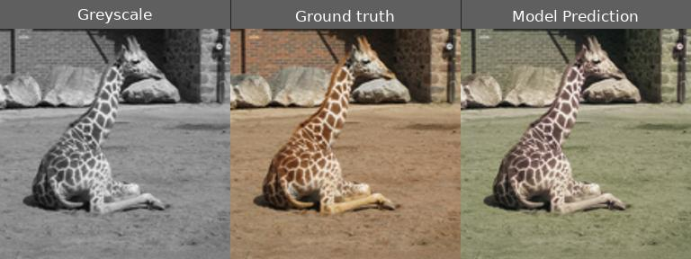
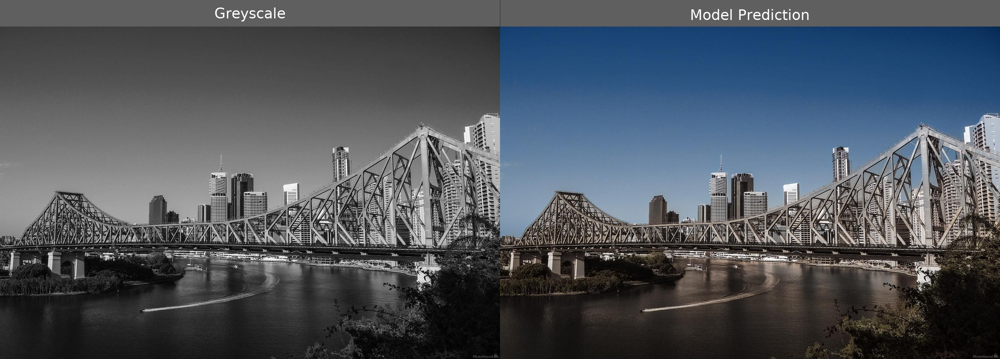
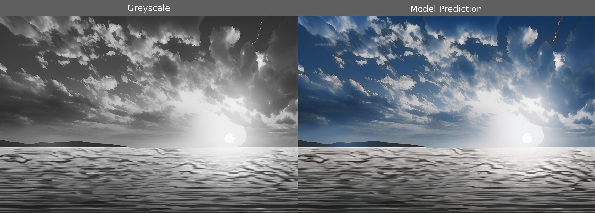
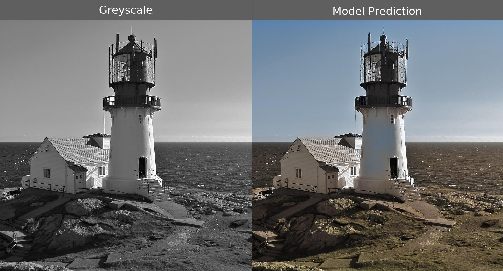
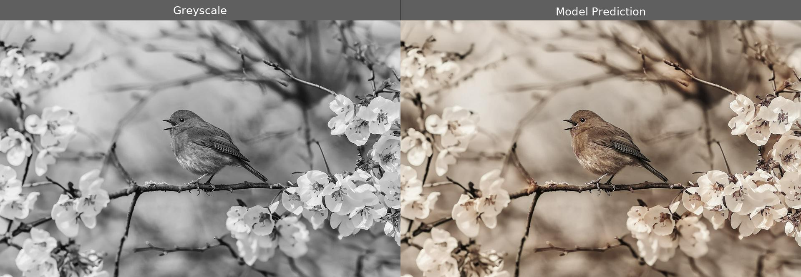
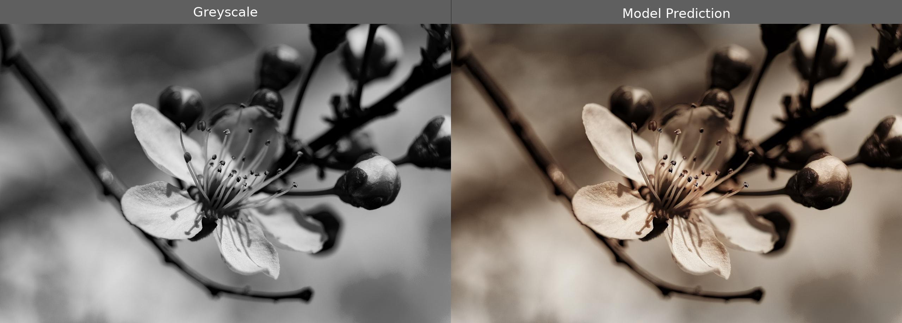
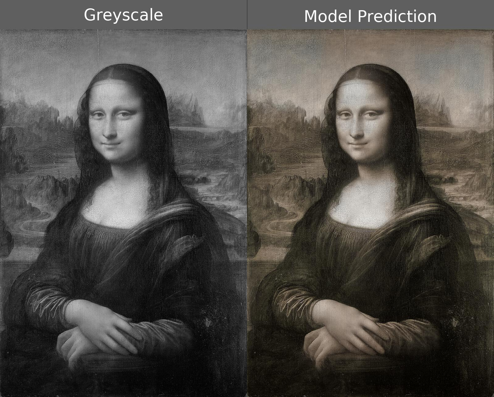
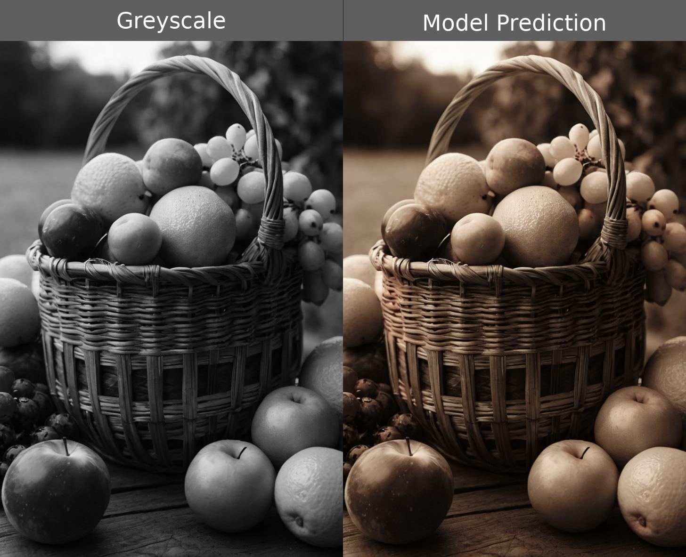
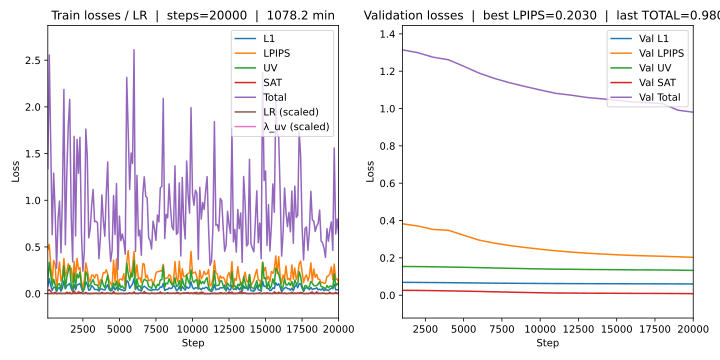

# 🖼️ Greyscale to Colour Image Conversion using MambaIRv2

**Author:** Youssef Hassan (48621573)  
**Course:** COMP3710 – Pattern Recognition and Analysis (2025)  
**Difficulty:** Hard

---

## Table of Contents
- [Overview](#overview)
- [Problem Statement](#problem-statement)
- [Algorithm Description](#algorithm-description)
- [Mamba Architecture Explanation](#mamba-architecture-explanation)
- [Architecture Visualization](#architecture-visualization)
- [How It Works](#how-it-works)
- [Dependencies](#dependencies)
- [Project Structure](#project-structure)
- [Installation](#installation)
- [Makefile Recipes](#makefile-recipes)
- [Dataset & Preprocessing](#dataset--preprocessing)
- [Training Strategy](#training-strategy)
- [Usage](#usage)
- [Example Results and Analysis](#example-results-and-analysis)
- [Training Performance and Plots](#training-performance-and-plots)
- [Notes on Preprocessing & Splits](#notes-on-preprocessing--splits)
- [Further Development](#further-development)
- [References](#references)
- [Acknowledgements](#acknowledgements)

---

## Overview

This repository fine-tunes **MambaIRv2**, an advanced **state-space image restoration model**, to perform **greyscale-to-colour conversion**.  
The project adapts pretrained RGB→RGB restoration weights (`mambairv2_ColorDN_15`) for greyscale→RGB mapping using a four-part composite loss: **L1**, **LPIPS**, **chroma-aware YUV**, and **saturation prior (SAT)**.  
The approach produces high-quality, perceptually realistic colour reconstructions from single-channel images and is fully reproducible through its provided configuration, datasets, and training scripts.

---

## Problem Statement

Greyscale colourization is a **challenging inverse problem** — one intensity pattern can map to many valid colour combinations. The model must infer context, texture, and semantics to produce convincing colour.  
This project’s objective is to generate accurate and perceptually consistent colours while maintaining structural integrity.  
Challenges addressed:
- Missing chroma data → inferred via learned semantics.  
- Avoiding oversaturation or washed-out colours.  
- Maintaining luminance detail from greyscale input.  

---

## Algorithm Description

The **MambaIRv2** backbone is an *Attentive State Space Model (SSM)* that models long-range image dependencies with linear time complexity, replacing attention with selective SSM layers.

### Adaptations for Colourization
- **Input format:** Replicates greyscale luminance to 3 channels (`grey3`) for compatibility with pretrained RGB weights.  
- **Output:** Full RGB prediction.  
- **Loss function:**  
 **Total Loss:** $= \lambda_{L1} \cdot L_{1} \;+\; \lambda_{LPIPS} \cdot L_{LPIPS} \;+\; \lambda_{UV}(t) \cdot L_{UV} \;+\; \lambda_{SAT} \cdot L_{SAT}$
  - *L1*: Charbonnier loss for reconstruction stability.  
  - *LPIPS*: Perceptual similarity.  
  - *UV*: Chroma-weighted error (weighted by ground-truth colourfulness).  
  - *SAT*: Saturation prior to discourage dull colours.  
- **Dynamic λ<sub>UV</sub>:** Uses cosine decay (with optional “hold” schedule) to reduce chroma weighting later in training.  
- **Chroma jitter:** Adds small UV noise during training to encourage richer colours.  
- **AMP + EMA:** Mixed precision with exponential moving average for stable convergence.  
- **Tiled inference:** Efficient prediction on large images using overlapping patches.

---

## Mamba Architecture Explanation

The **Mamba block** replaces conventional attention with a **Selective State Space Model (SSM)** — allowing it to model long-range dependencies linearly with respect to sequence length.  
Each block passes information sequentially, maintaining a latent “state” that remembers previous spatial context.


*Figure 1. Mamba Block Development Diagram*

**Core Components:**
1. **Input Projection** – maps input feature patches into latent channels.  
2. **Selective State Update** – dynamically gates which features are stored, similar to a recurrent memory.  
3. **Output Projection** – reconstructs the feature map with enriched long-range information.  

In MambaIRv2, these state-space blocks are stacked hierarchically to capture both local textures and global semantic cues, essential for plausible colour inference.


*Figure 2. MambaIRv2 Diagram*

*Diagrams adapted from [Gu et al., 2023](https://arxiv.org/abs/2312.00752) and [Guo et al., 2024](https://arxiv.org/abs/2312.00752).*

---

## Architecture Visualization

```
Input (Greyscale)
   ↓
grey → Equalize → Stack (Y³)
   ↓
conv_first
   ↓
Mamba Blocks (6× state-space layers)
   ↓
conv_after_body
   ↓
conv_last
   ↓
Predicted RGB Output
```

**Loss Calculation:**
$L_{total} = \lambda_{L1} \cdot L_{1} \;+\; \lambda_{LPIPS} \cdot L_{LPIPS} \;+\; \lambda_{UV}(t) \cdot L_{UV} \;+\; \lambda_{SAT} \cdot L_{SAT}$

---

## How It Works

1. **Dataset Handling:** Loads COCO-2017 automatically (train/val split).  
2. **Preprocessing:** Each RGB sample → equalised greyscale input (`grey3`).  
3. **Training Pipeline:**  
   - Uses pretrained MambaIRv2 weights for transfer learning.  
   - Losses are balanced adaptively via cosine scheduling.  
   - Mixed-precision (AMP) and exponential moving averages (EMA) are enabled for stability.  
4. **Validation:** Periodically evaluated using LPIPS, PSNR, and SSIM metrics.  
5. **Logging & Visualization:**  
   - Tracks per-step losses via `StatTracker`.  
   - Produces live `plots.svg` and `logs/train_log.csv`.  
   - Exports comparison panels (`outputs/.../panels`).  

> Below is an example of a panel outputted during training:


---

## Dependencies

The complete environment is defined in `env.yml`.  
To recreate:
```bash
make setup
conda activate mamba-colour
```

**Key Libraries:**
| Library | Version | Purpose |
|----------|----------|----------|
| PyTorch | ≥2.0.1 | Deep learning core |
| torchvision | ≥0.15 | Image processing |
| basicsr | latest | MambaIRv2 architecture |
| lpips | 0.1 | Perceptual similarity metric |
| pycocotools | latest | COCO dataset tools |
| Pillow | ≥10.0 | Image I/O |
| matplotlib | latest | Training plots |

---

## Project Structure

A breakdown of each major component for clarity:

| File | Description |
|------|--------------|
| `train.py` | Main training script: handles dataloaders, optimization, logging, and checkpointing. |
| `predict.py` | Inference pipeline: loads trained checkpoint, performs batched or tiled prediction, and saves panels. |
| `dataset.py` | Data loading utilities: COCO dataset handling, augmentations, greyscale replication. |
| `modules.py` | MambaIRv2 model definition, including colourization head and modified loss outputs. |
| `utils.py` | Helper functions for YUV conversion, LPIPS loss computation, metric tracking, and cosine decay scheduling. |
| `config.yml` | Central configuration file for hyperparameters and paths. |
| `Makefile` | Simplifies environment setup. |

**Tip:** Edit `config.yml` to adjust hyperparameters, dataset paths, or loss weights without changing source code. These can also be altered with command-line arguments.

---

## Installation

### 1️⃣ Clone Repository
```bash
git clone https://github.com/GuardianCoding/PatternAnalysis-2025.git
cd PatternAnalysis-2025/recognition/topic-recognition
```

### 2️⃣ Setup Environment
```bash
make setup

conda activate mamba-colour
```

The script used by the Makefile (`install_mambair.sh`) will automatically create the environment `mamba-colour`, clone the latest MambaIRv2 repository, make it importable via `pip`, and download the release that contains all the pretrained checkpoints needed for training.

---

## Makefile Recipes

The `Makefile` simplifies setup and maintenance.

| Recipe | Description |
|:-------|:-------------|
| `make setup` | Creates the Conda environment and installs dependencies via `env.yml`. |
| `make reinstall` | Reinstalls dependencies without recreating the environment. |
| `make clean` | Removes downloaded MambaIRv2 source code. |
| `make veryclean` | Deletes the Conda environment. |

Use `make setup` for first-time setup, or `make reinstall` after editing dependencies.

---

## Dataset & Preprocessing

| Step | Description |
|------|--------------|
| **Dataset** | COCO 2017 (`train2017`, `val2017`) |
| **Auto-download** | Automatically downloads COCO using `pycocotools` and safe extraction. |
| **Resize** | Random long-side resize (1.0–1.15×) |
| **Crop** | Random 256×256 crop (colour-biased selection for early epochs) |
| **Flip** | 50% horizontal flip |
| **Augment** | Brightness, contrast, and saturation jitter (probability set in config) |
| **Convert** | RGB → greyscale → replicated to 3 channels (`grey3`) |

**Chroma Bias:**  
During early epochs, multiple random crops are sampled and the most colourful patch is chosen (`chroma_bias_try`). This gradually disables after warmup.

**Subset Sampling:**  
Each epoch draws a deterministic subset of the dataset from a fixed random pool (`train_pool_size`, `epoch_subset_size`), ensuring diversity and reproducibility.

**Train/Validation Split:**  
The split used is the default split supplied by the COCO detection dataset. 

**Random Seeds:**
Random seeds and deterministic dataloader options are fixed to ensure identical results across runs.

> **Warning:** The COCO dataset is quite large (**~40GB**) of data.
> Ensure you have enough space, or download a smaller set manually and override the `auto_download` argument in `config.yml` and replace the dataset paths.

---

## Training Strategy

The model is trained using a **two-stage fine-tuning** process designed to gradually adapt pretrained RGB→RGB restoration weights for the new greyscale→RGB colourization task.

| Stage | Description | Learning Rate | Loss Functions |
|--------|--------------|----------------|----------------|
| **Stage 1 – Structural Adaptation** | All layers except the final K high-level blocks and output heads are frozen. This phase allows the model to learn the greyscale→colour mapping while preserving the pretrained feature hierarchy. | 3e-4 | **Charbonnier (L1)** – stabilizes reconstruction and prevents large gradient spikes. |
| **Stage 2 – Full Fine-Tuning** | All layers are unfrozen for end-to-end optimization, enabling the model to refine colour consistency and semantic detail. | 5e-5 | **L1 + LPIPS + UV + SAT**<br>• *L1:* pixel-wise consistency.<br>• *LPIPS:* perceptual similarity.<br>• *UV:* chroma-weighted loss (with cosine-decayed λ<sub>UV</sub>).<br>• *SAT:* saturation prior to prevent dull colours. |

**Key Features:**
- **Warmup–Cosine LR Schedule:** Smoothly ramps up the learning rate before gradually decaying.  
- **Gradient Accumulation:** Enables larger effective batch sizes without extra VRAM.  
- **EMA Weights:** Maintains an exponential moving average for more stable validation.  
- **Chroma Bias & Dithering:** Early epochs favour more colourful crops and apply small chroma noise to encourage vibrant outputs.  
- **Validation Panels:** Qualitative side-by-side comparisons are periodically saved to monitor visual progress.

---

## Usage

### Training
```bash
python train.py --config config.yml --pretrained checkpoints/mambairv2_ColorDN_15.pth
```

**Outputs are saved under:**
```
outputs/<exp_name>/
├── checkpoints/
├── logs/
├── panels/
├── plots.svg
└── config_merged.yaml
```

**Inference Command:**
```bash
python predict.py --config config.yml   --ckpt outputs/<exp>/mamba_colorizer_best.ckpt   --test_root ./datasets/test_images   --tile 512 --overlap 32 --amp
```

**Output Directory:**
```
outputs/predict/mamba_colorizer/
├── color/     → Generated colour images
├── panels/    → Comparison grids
├── metrics.csv
└── config_merged.yaml
```

---

## Training Hardware

| Resource | Specification |
|-----------|---------------|
| **GPU** | NVIDIA A100 SXM (1× GPU) |
| **vCPU** | 32 cores (AMD EPYC processor) |
| **System Memory** | 250 GB RAM |
| **Container Disk** | 100 GB SSD storage |

**Notes:**  
- Training and testing were conducted on a runpod.io A100 pod with the following image: `runpod/base:1.0.2-ubuntu2204`.
- Training was performed on a single A100 GPU with mixed-precision (AMP) enabled.  
- High system memory and CPU thread count ensured fast COCO dataset preprocessing and dataloader throughput.  
- All experiments ran inside an isolated containerized environment for full reproducibility.

---

## Example Results and Analysis

The following examples showcase the qualitative performance of the colourization model on unseen test images. Each panel shows **Input (left)** and **Predicted Colour Output (right)** side by side. 
 These are all sourced from the test set available at [*this Github repo*](https://github.com/gayanku/greyscale-colorization). The full set as predicted by the Model can be found in the [assets folder of the repo.](./assets/)

> Panels are generated by `predict.py` when ran with a test set and these can be found under `outputs/predict/<exp>/panels/`.

---

### Example 1 — Brisbane City Story Bridge (Strong Result)


**Analysis:**  
- Outstanding tonal and colour reconstruction; realistic sky-blue and steel hues.  
- Model preserved architectural detail and shadow balance.  
- Represents the ideal outcome of Stage 1’s structural adaptation with stable pretrained RGB priors.  

---

### Example 2 — Ocean Sunset (Strong Result)


**Analysis:**  
- Excellent chroma transition between sky and reflection.  
- Maintains depth and subtle warmth without oversaturation.  
- Demonstrates balanced L1 + LPIPS interaction and effective luminance retention.  

---

### Example 3 — Lighthouse Scene (Strong Result)


**Analysis:**  
- Excellent global illumination with realistic sky blues and sea hues.  
- Smooth chroma transition across horizon; no visible colour banding or artefacts.  
- Structural features such as the tower edges and roof textures remain crisp and correctly shaded.  
- Slightly cool cast on shadows shows minor bias from pretrained RGB weights, but overall chroma-luminance balance is highly convincing.  
- Exemplifies strong Stage 1 feature retention and stable UV–SAT loss interaction.

### Example 4 — Bird on Blossoms (Strong Result)


**Analysis:**  
- Highly natural composition: distinct warm tones on feathers and muted background.  
- Fine edge fidelity shows strong mid-level feature retention.  
- Model generalizes well to organic textures with moderate chroma complexity.  

---

### Example 5 — Flower Macro (Moderate Result)


**Analysis:**  
- Sharp detail and consistent lighting, but hue variation is limited.  
- Sepia cast across petals indicates early UV-loss decay.  
- LPIPS dominated texture reconstruction over colour vibrancy.  

---

### Example 6 — Mona Lisa (Moderate Result)


**Analysis:**  
- Retains painting texture faithfully, though chroma remains subdued.  
- Luminance mapping strong; however, warm hues underdeveloped.  
- Confirms desaturation pattern introduced by full unfreezing in Stage 2.  

---

### Example 7 — Basket of Produce (Weak Result)


**Analysis:**  
- Colour diversity lost; uniform brown tint dominates.  
- Suggests low-level feature drift after Stage 2 unfreezing.  
- Could improve through partial freezing or extended λ<sub>UV</sub> hold to preserve chroma gradients.  

---

### Summary

Across the test set, the model consistently reproduces **realistic structure and tonal balance**, particularly in **outdoor daylight scenes** (G₁, G₇, G₂₂).  
However, chroma intensity diminishes in **low-saturation or artificial-light scenarios** (G₂₁, G₁₁, G₁₀), aligning with the desaturation trends observed post–Stage 2, reflecting the Stage 2 trade-off between perceptual (LPIPS) and chroma (UV) optimization.    

**Future improvements:**
- Retain partial layer freezing to prevent chroma drift.  
- Extend λ<sub>UV</sub> decay scheduling for sustained colour richness.  
- Introduce warm-tone and artistic-domain augmentations to increase hue diversity.

---

## Training Performance and Plots



**Observed Behaviour:**

| Phase | Behaviour | Interpretation |
|:------|:-----------|:----------------|
| **Stage 1 (Epoch 1–5)** | Sharp L1 ↓ and LPIPS ↓; UV loss stable | Model learned grayscale→colour mapping while keeping pretrained spatial filters intact. |
| **Transition to Stage 2** | Spike in total loss due to new UV + SAT terms | Expected when switching objectives. |
| **Stage 2 (Epoch 6–10)** | Gradual total-loss decline but rising LPIPS/L1 ratio | Perceptual term began dominating; low-level weights over-adapted. |
| **Validation curves** | Plateaued after mid-training | Indicates convergence; further fine-tuning yields diminishing returns. |

### Summary

**Overall, the two-stage strategy achieved stable convergence and perceptually realistic outputs with diminishing returns beyond epoch 9–10.**

---

## Notes on Preprocessing & Splits

- Equalized greyscale improves contrast and texture awareness.  
- Cosine decay for λ<sub>UV</sub> balances early chroma learning with late texture refinement.  
- Mixed-precision training improves VRAM efficiency without numerical instability.  
- COCO’s dataset variety enables the model to generalize across lighting and material types.  

---

## Further Development

### 1. Dataset Expansion
- Fine-tune on datasets emphasizing **warm colours and faces** (e.g., CelebA-HQ, Flower102).  
- Incorporate domain-specific lighting augmentations (golden hour, fluorescent light).  

### 2. Improved Loss Design
- Introduce asymmetric weighting in YUV loss to favour under-represented warm tones.  
- Add an **adversarial component (GAN)** for more vibrant outputs.  

### 3. Model Extensions
- Experiment with **multi-scale Mamba heads** or larger variants (`MambaIRv2-L`).  
- Implement **attention fusion** between shallow and deep layers.  

### 4. Evaluation and Deployment
- Add a **Streamlit/Gradio demo** for user uploads.  
- Automate metric computation and panel generation during inference.  

### 5. Interpretability
- Integrate **Grad-CAM** to visualize which regions influence chroma predictions.  

---

## References

1. [Guo, C. *et al.* (2024). *MambaIRv2: Attentive State Space Restoration.*](https://arxiv.org/abs/2411.15269)  
2. [Zhang, R. *et al.* (2018). *The Unreasonable Effectiveness of Deep Features as a Perceptual Metric (LPIPS).*](https://github.com/richzhang/PerceptualSimilarity)  
3. [Lin, T.-Y. *et al.* (2014). *Microsoft COCO: Common Objects in Context.*](https://cocodataset.org)  
4. [Gu, A. & Dao, T. (2023). *Mamba: Linear-Time Sequence Modeling with Selective State Spaces.*](https://arxiv.org/abs/2312.00752)
5. [`greyscale-colorization` Github repo](https://github.com/gayanku/greyscale-colorization)  

---

## Acknowledgements

This repository extends the official **MambaIRv2** implementation with a custom fine-tuning and evaluation pipeline for colour restoration. This project demonstrates the practical application of advanced state-space architectures to an ill-posed inverse imaging task.

Developed by **Youssef Hassan** for the **COMP3710 Pattern Analysis (2025)** project at **The University of Queensland**.

Special thanks to Dr. Shakes Chandra, Dr Gayan Kulatilleke, and my Runpod.io credits.

---